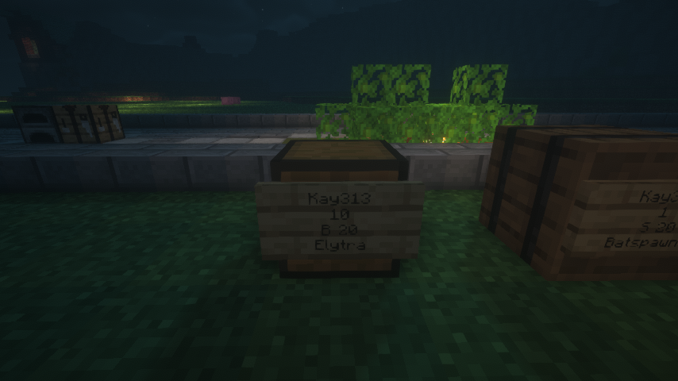
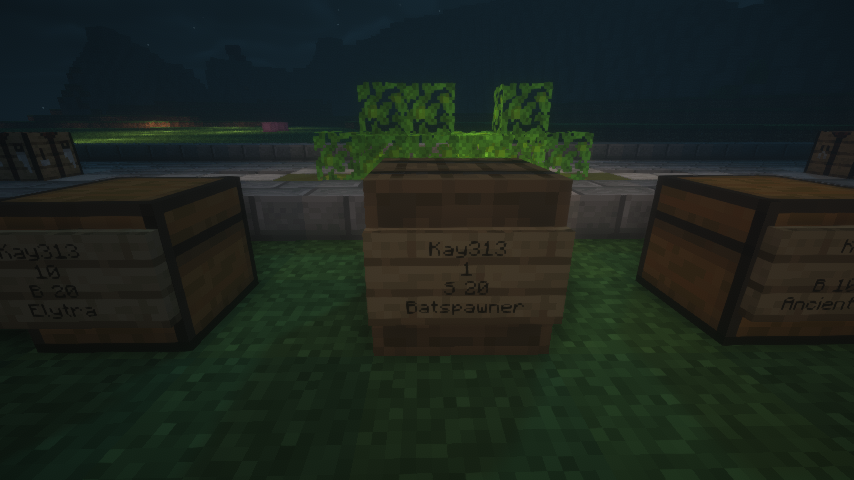
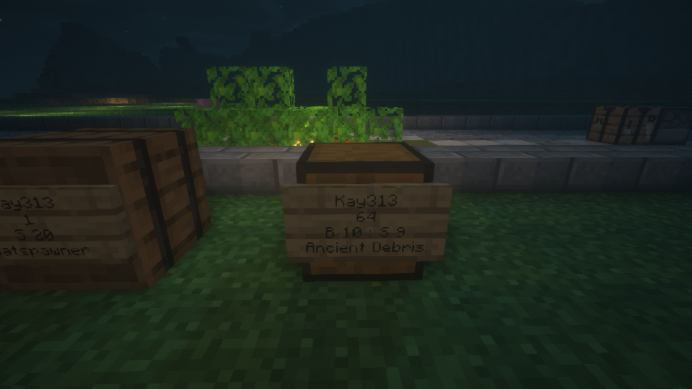
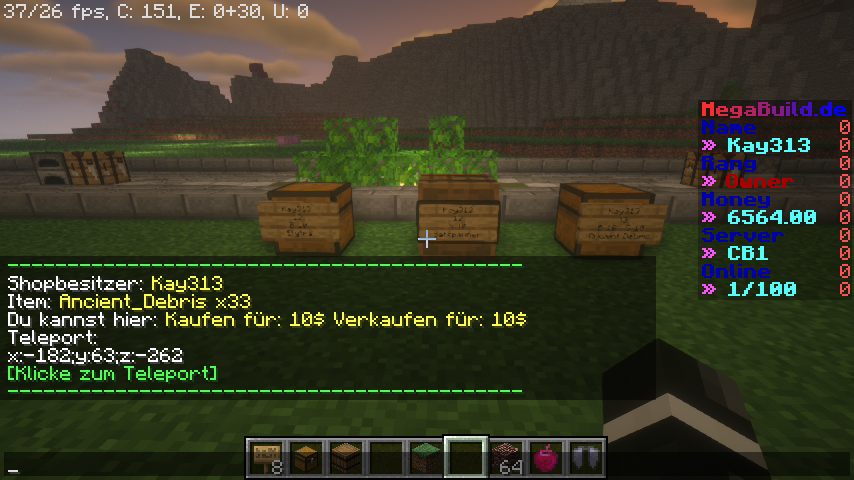
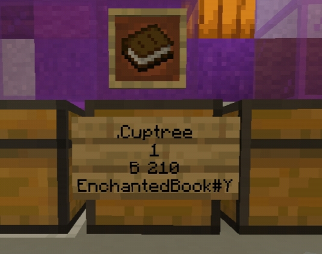
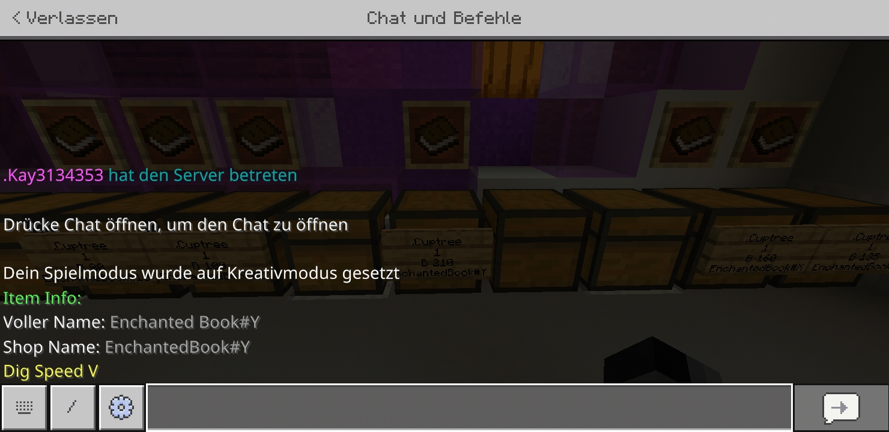

# ChestShop

## Wie benutze ich einen ChestShop?

Du platzierst eine Truhe oder ein Barrel und an diesem ein Schild. \
Zeile 1: Leer lassen \
Zeile 2: Wie viel willst du verkaufen, z.B. 12 \
Zeile 3:

1. Wie viel soll es kosten, z.B. **B 12** (B = Buy (Spieler kauft vom ChestShop); 12 = Wie viel kostet es)
2. Wie viel gibt es pro Verkauf an den ChestShop, z.b. **S 20** (S = Sell (Spieler verkauft an den ChestShop); 20 = Wie viel gibt es für den Verkauf)
3. Buy und Sell kombiniert, z.B. **B 12 : S 20** (Kaufen und Verkaufen möglich)

Zeile 4: ? (Nach dem Erstellen musst du mit dem Item auf das Schild klicken) \
\
» 1. (Bild 1 bzw. erste Truhe im [Video](https://youtu.be/tjeOA\_qcuAY)) \
» 2. (Bild 2 bzw. zweite Truhe im [Video](https://youtu.be/tjeOA\_qcuAY)) \
» 3. (Bild 3 bzw. dritte Truhe im [Video](https://youtu.be/tjeOA\_qcuAY))

<figure><figcaption>
Bild 1
</figcaption></figure>

<figure><figcaption>
Bild 2
</figcaption></figure>

<figure><figcaption>
Bild 3
</figcaption></figure>

## Wie suche ich nach bestimmten ChestShops (/shopsearch)?

Du kannst mit **/shopsearch** nach bestimmten ChestShops suchen

Bsp.: **/shopsearch Ancient\_Debris**

Es werden dir dann einige Informationen zum Shop angezeigt

» Bild 4

<figure><figcaption>
Bild 4
</figcaption></figure>

## Was muss ich tun wenn mir sowas (Bild 5) auf dem Schild angezeigt wird?

Unser ChestShop zeigt nicht bei jedem Item den Namen oder die Signatur an (z.b. Custom-Renames oder ähnliches). Wenn ihr sowas seht könnt ihr ganz einfach über den folgenden Command nachvollziehen welches, Enchant-Buch beispielsweise, im ChestShop liegt.\
\
Command: **/iteminfo \<Name-auf-dem-Schild>**\
\
Beispiel:

1. /iteminfo EnchantedBook#Y
2. Ergebnis welches Enchant-Buch es ist wird im Chat angezeigt

» 1. (siehe Bild 5) \
» 2. (siehe Bild 6)

<figure><figcaption>
Bild 5
</figcaption></figure>

<figure><figcaption>
Bild 6
</figcaption></figure>

