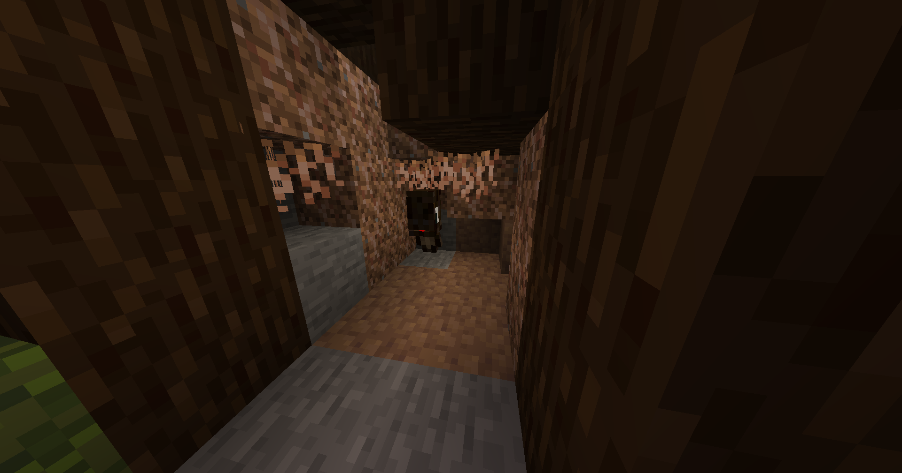
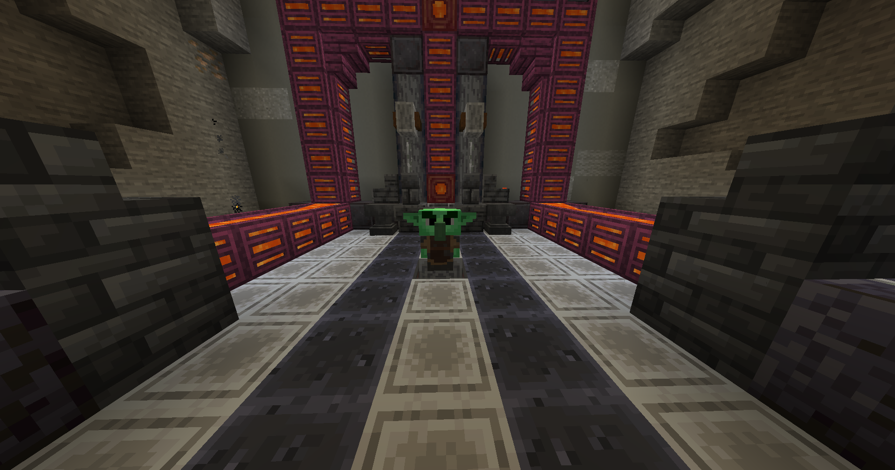
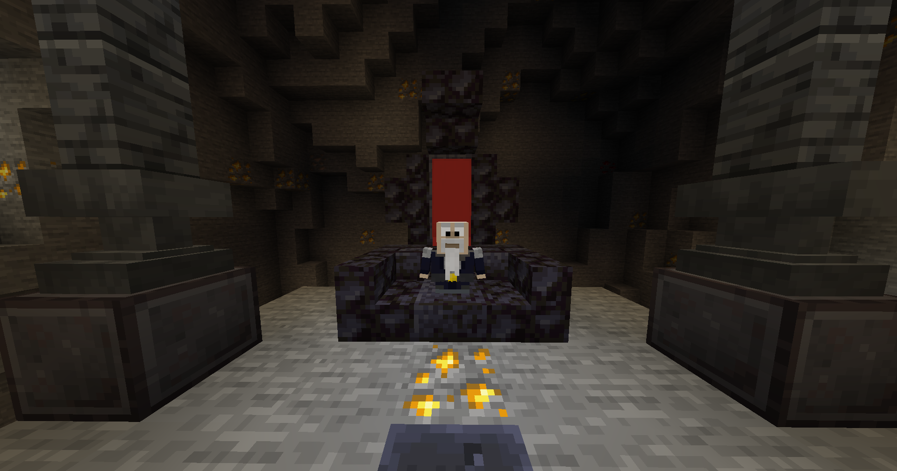
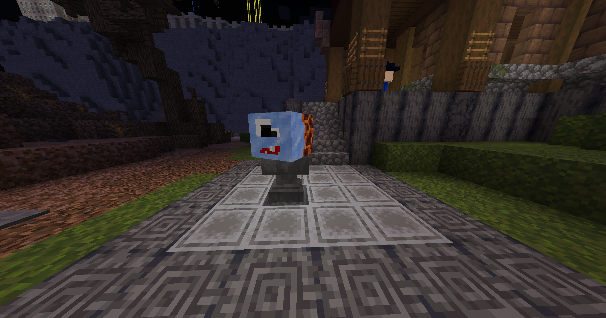
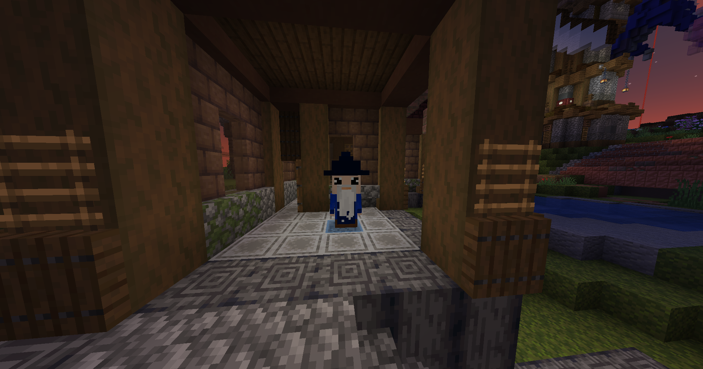
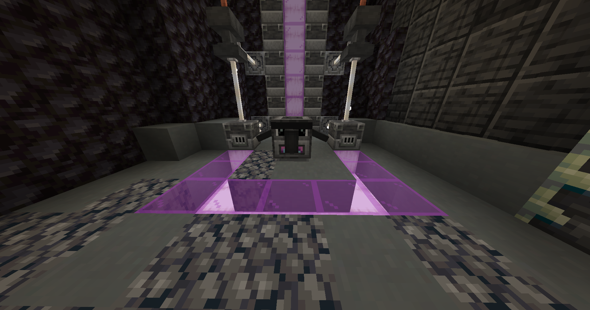
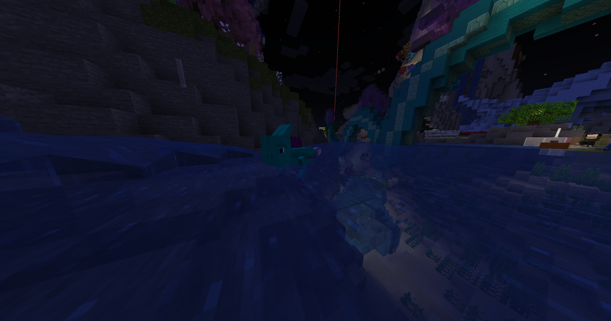
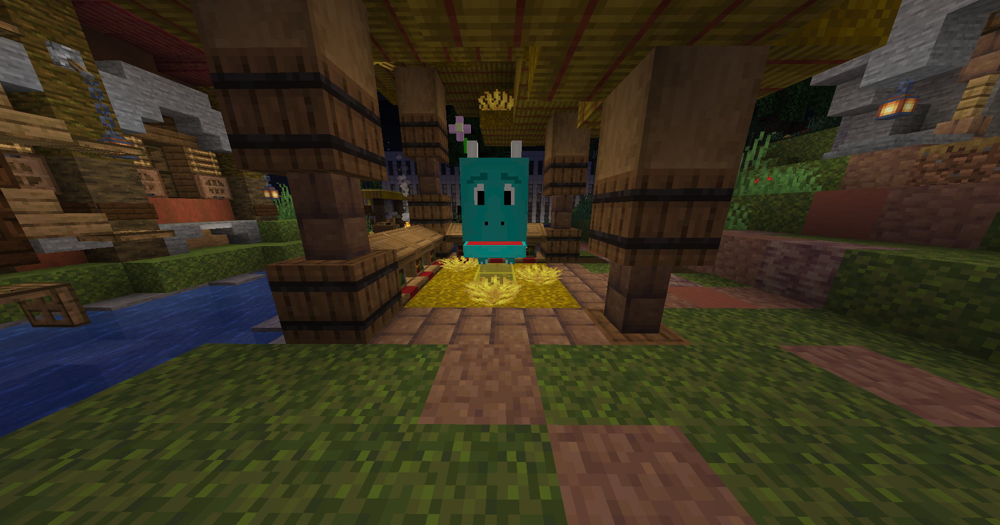

# Helper

Durch unsere Helper am CB Spawn kannst du bspw. deine Items reparieren, deine [Artefacte/Pets](artefacts.md) umtauschen oder neu erstellen, dir deine Items in Mana umwandeln lassen, und noch mehr erledigen.

### Biddels

Lasse dir von Biddels für einen bestimmten [Mana](mana.md)-Preis, welcher sich jeden Tag ändert eine zufällige Anzahl eines Random Item geben.

<figure><figcaption>
Biddels ist am Rande des Spawns in einer Baumhöhle zu finden
</figcaption></figure>

### Dieter

Von Dieter kannst du dir dein aktuelles Item in der Hand mit 10 [Mana](mana.md) sofort reparieren lassen.

<figure><figcaption>
Dieter ist in den Goblin Minen am Spawn zu finden
</figcaption></figure>

### Herbert

Bei Herbert kannst du dir einen [Head](head.md) abholen.\
Nähere Infos dafür findest du auf der [head.md](head.md "mention")-Seite.

<figure><figcaption>
Herbert ist auch in den Goblin Minen am Spawn zu finden
</figcaption></figure>

### Milly & Chilly

Lasse dir bei Milly & Chilly dein altes [Artefact/Pet](artefacts.md) in ein neues zufälliges umwandeln, die Kosten hierfür betragen 500 [Mana](mana.md) und dein altes Artefact/Pet, danach kannst du dir dein neues Artefact/Pet nach 3 Tage abholen.

<figure><figcaption>
Milly &#x26; Chilly sind am Rande des CB Spawns zu finden
</figcaption></figure>

### Moony

Gebe Moony ein Totem und 10000 [Mana](mana.md), und er lässt seine Fähigkeiten für dich arbeiten. Warte einen Tag und hole dir dann dein neues zufälliges [Artefact/Pet](artefacts.md) ab.

<figure><figcaption>
Direkt neben Milly &#x26; Chilly wartet Moony auf dich
</figcaption></figure>

### Muncho

Wandel bestimmte Items (mehr dazu findest du Ingame im Menü) in [Mana](mana.md) bei Muncho um oder zahle es dir bei jenem in ein Mana-Item aus, welches den Wert von 10 Mana hat. Dieses kannst du dann z.B. Verkaufen oder wieder einlösen um 10 Mana zu erhalten. Wenn du Muncho mit Items fütterst wird er dir je nach Wert des Items nach einer bestimmten Zeit immer mal wieder Mana auszahlen, welches du dann für verschiedene Bereiche verwenden kannst.

<figure><figcaption>
Muncho ist im Vulkan gegenüber von Moony zu finden
</figcaption></figure>

### Scampi

Du möchtest dir jeden Tag kostenloses [Mana](mana.md) abholen?, dann bist du bei Scampi genau richtig! Diesen findest du am Strand, er schwimmt im Wasser herum und versucht sich nicht fangen zu lassen, sollte es dir doch gelingen warten 1500 [Mana](mana.md) auf dich.

<figure><figcaption>
Scampi ist am Strand beim CB Spawn zu finden
</figcaption></figure>

### Warper

Am Spawn kannst du insgesamt 5 verschiedene Warper finden, welche dir helfen am CB Spawn schneller von A -> B zu kommen.

<figure><figcaption>
Einer der 5 Warper, dieser ist im Dorf zu finden
</figcaption></figure>
