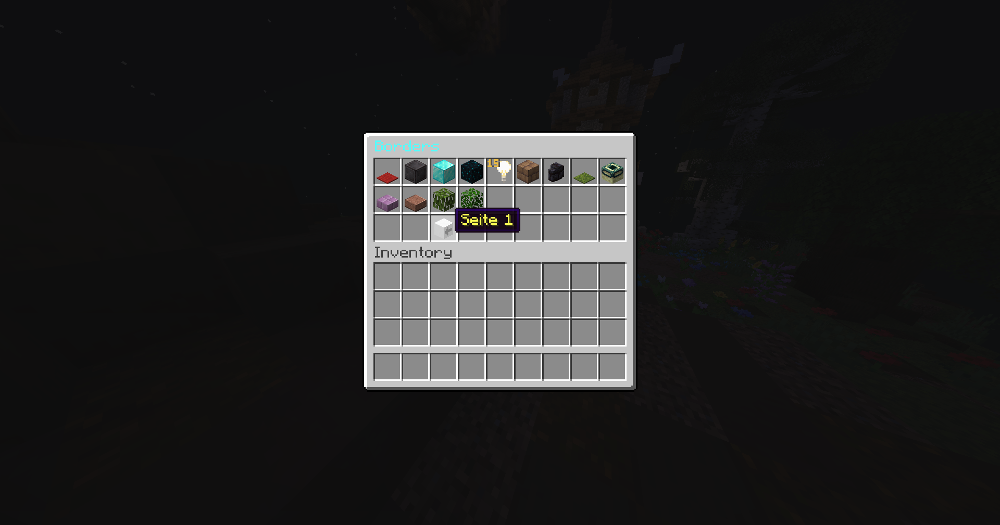
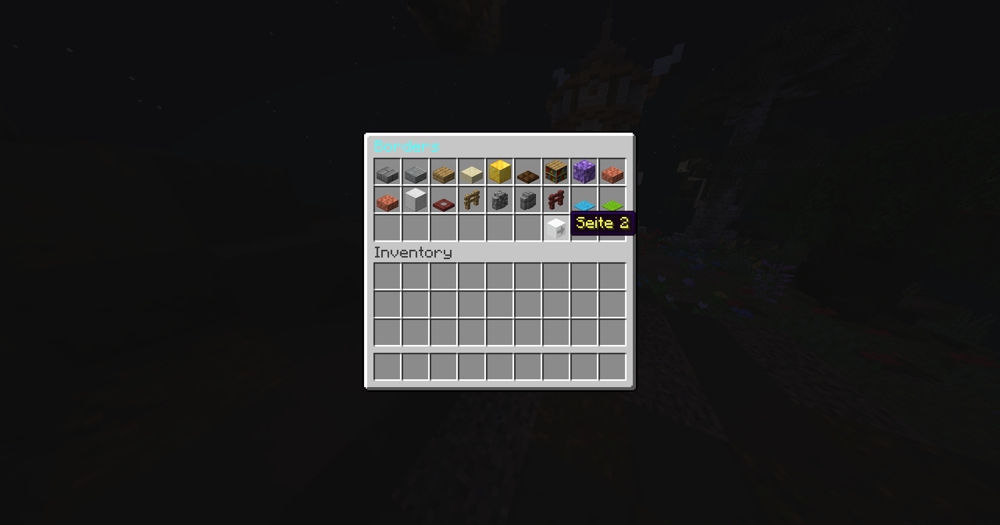
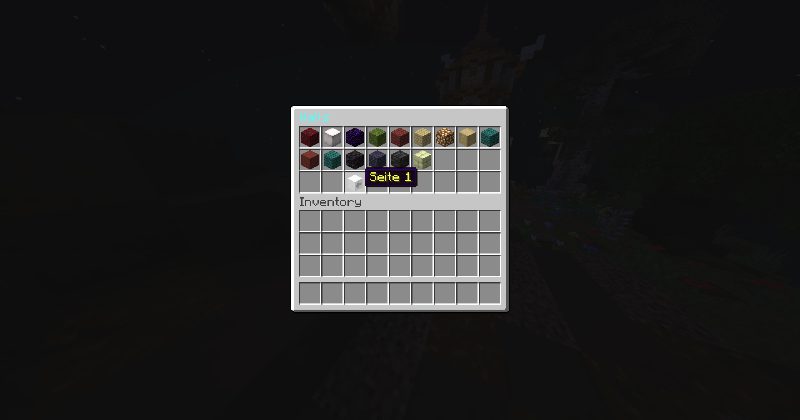
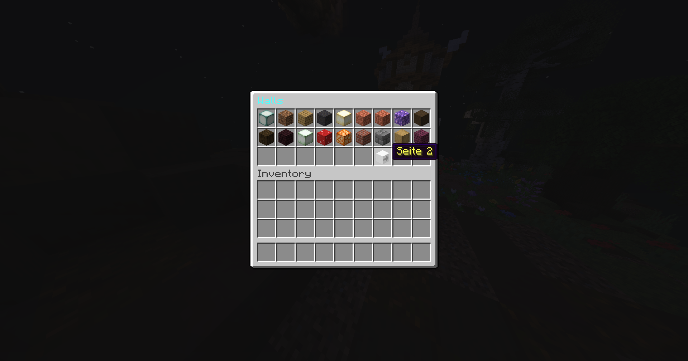

# Plot, Wall and Border

### Allgemeine Plot Befehle:

**/p a** \
» Suche dir ein neues Grundstück\
**/p claim** \
» Beanspruche das Plot für dich \
**/p h** \
» Teleportiere dich zu deinem GS \
**/p h \<zahl>** \
» Teleportiere dich zu einem bestimmten GS von dir \
**/p i** \
» Zeige dir die GS Infos an \
**/p biome** \
» Setze ein Biom auf deinem GS \
**/p sethome** \
» Setze einen Namen auf deinem GS \
**/p v** \
» Besuche deine GSe \
**/p v \<name>** \
» Besuche ein GS eines Spielers \
**/p v** **\<id>** \
» Besuche ein GS mit der ID \
**/p middle** \
» Teleportiere dich in die Mitte deines GS \
**/p comment** \
» Setze einen Kommentar zum GS \
**/p chat** \
» Schreibe im GS Chat \
**/p toggle** \
» Blende bestimmte Nahrichten aus \
**/p desc** \
» Setze eine GS Beschreibung \
**/p add \<nam**e> \
» Gebe einem Spieler auf deinem GS Rechte wenn du online bist \
**/p trust \<nam**e> \
» Truste einen Spieler (kann jederzeit alles auf dem Plot machen) \
**/p deny \<name>** \
» Banne einen Spieler von deinem GS \
**/p kick \<name>** \
» Kicke einen Spieler von deinem GS \
**/p remove \<name>** \
» Entferne einen Spieler von deinem GS \
**/p undeny \<name>** \
» Entbanne einen Spieler von deinem GS \
**/p clear** \
» Setze dein Plot zurück \
**/p reset** \
» Setze dein Plot zurück \
**/p dispose** \
» Lösche dein Plot \
**/p delete** \
» Lösche dein Plot

### Zusätzliche Plots kaufen:

Um zusätzliche Plots zu kaufen und damit deine Plots zu erweitern, nutze: \
\
**/pbuy**

### Plot Border System:

Mit dem Border System kannst du deinen Plot Rand, je nach deinem Rang beliebig ändern. \
Nutze: **/border** ‎ \
\
**Spieler:** \
» Zugriff auf **4** Borders \
**Gold:** \
» Zugriff auf **6** neue Borders + die von Spieler \
**Platin:** \
» Zugriff auf **9** neue Borders + die von Gold \
**Titan:** \
» Zugriff auf **14** neue Borders + die von Platin \
\
_Alle Walls und Borders sind beliebig kombinierbar_

### Plot Wall System:

Mit dem Wall System kannst du deine Plot Wand, je nach deinem Rang beliebig ändern.\
Nutze: **/wall**\
\
**Spieler:** \
» Zugriff auf **4** Walls\
**Gold:** \
» Zugriff auf **6** neue Walls + die von Spieler \
**Platin:** \
» Zugriff auf **9** neue Walls + die von Gold \
**Titan:** \
» Zugriff auf **14** neue Walls + die von Platin \
\
_Alle Walls und Borders sind beliebig kombinierbar_

<figure><figcaption>
Plot Border System
</figcaption></figure>

<figure><figcaption>
Plot Border System
</figcaption></figure>

<figure><figcaption>
Plot Wall System
</figcaption></figure>

<figure><figcaption>
Plot Wall System
</figcaption></figure>
