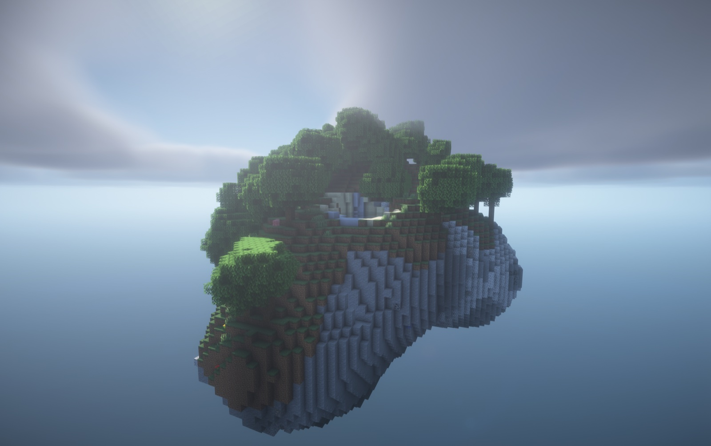

# Custom Skyblock

MegaBuild.de is starting fresh with a clear focus: **one main game instead of many parallel modes.**

The idea behind it: MegaBuild should not feel like the next standard server, but like your own world to build, unlock and keep playing.

<figure><figcaption>Custom-generated islands instead of a standard starter platform</figcaption></figure>


**Status: in development.**

The server is in maintenance mode and no final release date has been announced. The systems on this page are officially confirmed, but the **concrete details** – commands, numbers, prices, upgrade tiers – will be added here once they are final.

For announcements: [Discord](https://megabuild.de/dc/) · [status.megabuild.de](https://status.megabuild.de/)


## The new focus

Everything is aimed at giving you a motivating main game with its own direction, real progression and enough depth for many hours. MegaBuild should feel like a server you keep coming back to, not one you join once.



### 🏝️ Build, expand, grow

Your island starts small but gains more character, value and possibilities with every step.



### 🌱 Custom farming and automation

Not just standard routines, but systems that make growth, efficiency and planning genuinely fun.





### 📈 Progression that feels good

Trading, upgrades and unlocks interlock so you constantly feel like you are actually building something.



### ✨ Your own island world

Even the start should feel special: islands that don't look generic and make you want to expand and explore right away.



## The systems

### Custom island progression

Your island is the centre of everything you unlock, expand and work towards long term.

* Island upgrades and unlocks
* Custom generators and starting conditions instead of standard routines
* Goals designed for long-term play


[progression.md](progression.md)


### Economy and community

Players, trading and community should feel alive and gain more depth through server-native systems than typical off-the-shelf solutions offer.

* Trading and a server-wide economy
* Active events and community goals
* Perks that are meaningfully integrated into the main game


[economy.md](economy.md)


## Continue in the wiki



* [Getting started](start.md)
* [Your island](island.md)
* [Progression & upgrades](progression.md)



* [Farming & automation](farming.md)
* [Economy & trading](economy.md)
* [Community & events](community.md)


